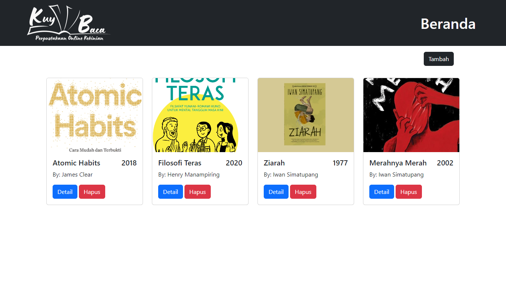
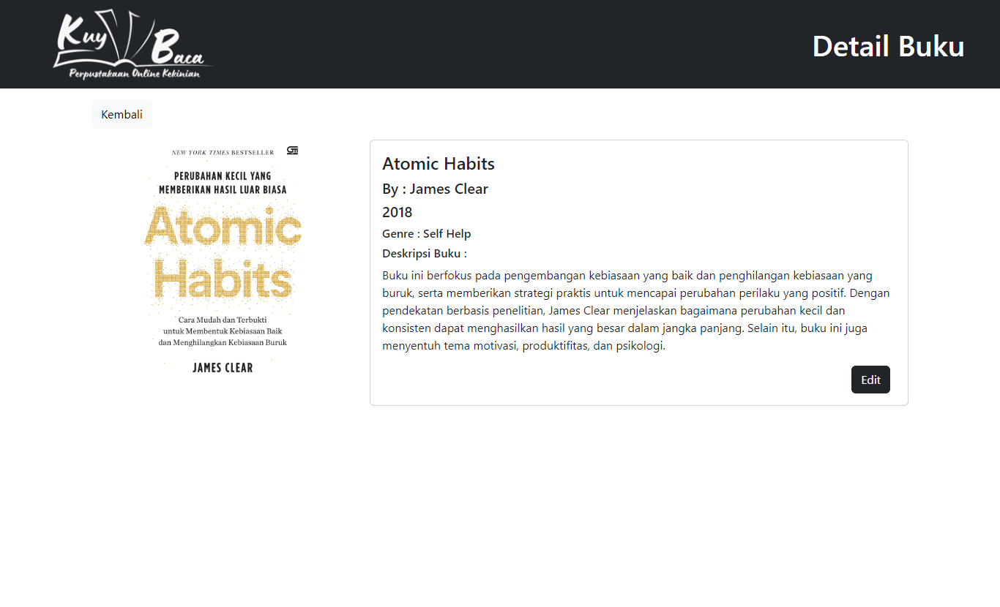
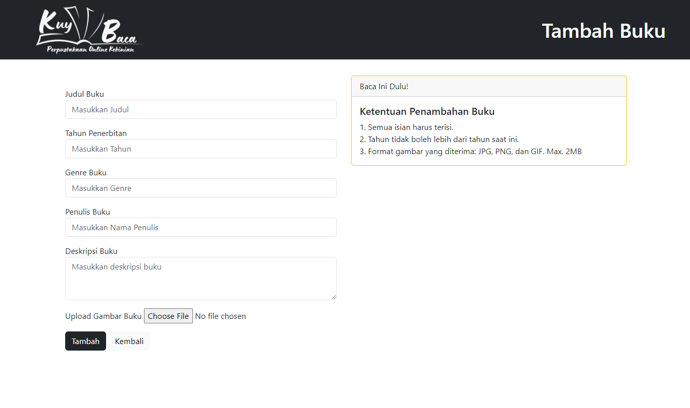
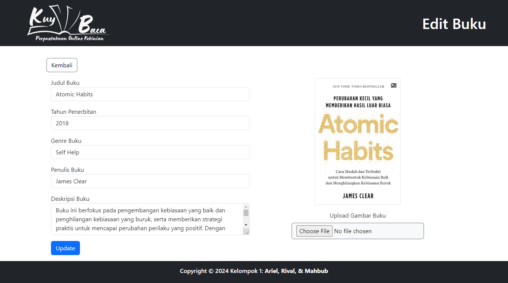

# Perpustakaan Online 📚

Perpustakaan Online ini dikembangkan sebagai bagian dari Capstone Project Surosowan Academy Web Development Batch 3. Proyek ini bertujuan untuk menyediakan solusi perpustakaan digital yang efisien, di mana pengguna dapat dengan mudah mengelola koleksi buku secara online. Antarmuka ini dirancang agar mudah digunakan oleh pengguna dalam menambah, mengupdate, menghapus, dan melihat koleksi buku. Kami juga mengimplementasikan prinsip desain responsif agar aplikasi dapat diakses dengan baik di berbagai perangkat, termasuk desktop dan mobile, memastikan pengalaman pengguna yang optimal di seluruh platform.

---

# Tampilan 🔎

* **Halaman Beranda**

  

* **Halaman Detail Buku**

  

* **Halaman Tambah Buku**

  

* **Halaman Update Buku**

  

---

# Tech Stack 🛠️
  1. **HTML** - Digunakan sebagai fondasi struktur halaman web, HTML membentuk elemen-elemen dasar antarmuka pengguna seperti form, tabel, dan tombol yang digunakan dalam aplikasi ini
  2. **Bootstrap** - Library CSS yang digunakan untuk membuat tampilan aplikasi menjadi responsif dan menarik. Dengan Bootstrap, kami dapat menciptakan layout yang konsisten dan mendukung berbagai ukuran layar tanpa harus menulis banyak kode CSS manual
  3. **JavaScript** - Digunakan untuk meningkatkan interaktivitas dan dinamisme pada halaman web. JavaScript memungkinkan penanganan event, manipulasi DOM, dan komunikasi antara frontend dan backend melalui API
  4. **jQuery** - Library JavaScript yang digunakan khusus untuk mempermudah proses AJAX dan berkomunikasi dengan API backend. jQuery membantu dalam pengambilan dan pengiriman data ke API secara asynchronous, serta mempermudah manipulasi elemen DOM
